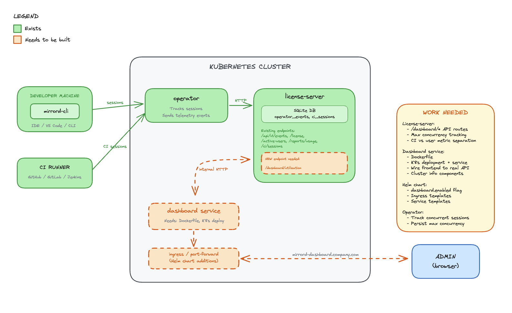

- Feature Name: dashboard_backend
- Start Date: 2026-02-02
- Last Updated: 2026-02-04
- RFC PR: [metalbear-co/rfcs#8](https://github.com/metalbear-co/rfcs/pull/8)
- RFC reference:
  - [Linear COR-1135](https://linear.app/metalbear/issue/COR-1135/admin-dashboard-wiring-backend-to-ui-part-1-all-time-metrics-section)
  - [Linear COR-1191](https://linear.app/metalbear/issue/COR-1191/explore-backend-endpoint-requirements-for-dashboard)

## Summary
[summary]: #summary

Deploy the Admin Dashboard as an in-cluster service alongside the mirrord operator. Usage data is stored in a SQLite database inside the license-server, which exposes it over an internal cluster HTTP API. The dashboard frontend is served through a Kubernetes ingress on the customer's own domain.

## Motivation
[motivation]: #motivation

Enterprise customers need visibility into mirrord usage across their organization. Currently:

1. **No centralized dashboard** - Usage data exists in the operator but isn't easily accessible to admins
2. **Customer demand** - Customers are asking for UI visibility into user activity
3. **Adoption tracking** - Cost controllers need to justify mirrord investment with concrete usage metrics
4. **Current workaround** - Users are directed to DataDog dashboards, which requires additional setup

### Use Cases

1. **IT Admin** wants to see how many developers are actively using mirrord this month
2. **Cost Controller** wants to calculate time saved to justify license renewal
3. **Team Lead** wants to identify power users for internal champions program
4. **Security Team** wants to audit which users accessed the cluster via mirrord

## Guide-level explanation
[guide-level-explanation]: #guide-level-explanation

The Admin Dashboard is deployed inside the customer's Kubernetes cluster as part of the mirrord operator Helm chart. Admins access it through a configured ingress (e.g., `mirrord-dashboard.company.com`).

### Deployment

```bash
helm upgrade mirrord-operator metalbear/mirrord-operator \
  --set dashboard.enabled=true \
  --set dashboard.ingress.enabled=true \
  --set dashboard.ingress.host=mirrord-dashboard.company.com
```

### All-Time Metrics Section

**Cluster & Version Info:**
- **Connected cluster name** - Shows which Kubernetes cluster the admin is currently viewing, according to context in `mirror.json`
- **Operator version + last update** - Shows the installed operator version and when it was last updated
- **Tier** - Shows the customer's subscription tier (e.g., Enterprise). Dashboard is supported for Ent. only
- **mirrord version installed** - Shows the version of mirrord operator / helm chart currently installed in the cluster
- **Check for updates button** - Redirects the admin to the charts CHANGELOG in a new tab

**Usage Metrics:**
- **Developer time saved** - Total developer time saved from mirrord sessions since adoption, as calculated in the ROI calculator
- **CI waiting time saved** - Total CI waiting time saved by mirrord, as calculated in the ROI calculator
- **Licenses used / acquired** - Seat usage vs. total available licenses
- **Active user sessions** - Number of currently active user sessions
- **Active CI sessions** - Number of currently active CI sessions
- **"Learn more about CI" link** - Help link for CI usage (hidden on Teams tier), opens CI docs in a new tab
- **Max user concurrency** - Peak concurrent user sessions since mirrord adoption
- **Max CI concurrency** - Peak concurrent CI sessions since mirrord adoption
- **Total session time** - Total time spent across all sessions, shown in human-readable form (years, months, weeks)

**Adjust Calculation (ROI Calculator):**
- Entry point to configure how time-saved values are calculated, opens a modal with:
  1. Number of all **user** sessions since adoption (display rounded up: tens up to 100, hundreds above 100, e.g. "1.1K sessions")
  2. Input for estimated time saved per user session (default: 15 min, no negative values)
  3. Number of all **CI** sessions since adoption (same rounding rules as user sessions)
  4. Input for estimated time saved per CI session (default: 15 min, no negative values)
  5. Preview of the calculated total time saved in hours

### Timeframe Data Section
- Date range picker (default: current month)
- Refresh button for real-time updates

### Usage Analytics Section
- Bar chart of top active users
- Pie chart of user activity distribution
- Toggle between session time vs session count

### User Activity Table
- Paginated list (20 users/page)
- Columns: Machine ID, Active Since, Last Session, Total Time, Sessions, Avg Duration

### API Endpoints

The license-server exposes dashboard data over internal cluster HTTP. No additional authentication is needed — both services run in the same namespace, and access control is handled at the ingress/port-forward level via K8s RBAC.

```
GET /api/v1/dashboard/utilization?from=<datetime>&to=<datetime>
  Response: UtilizationReport
```

## Reference-level explanation
[reference-level-explanation]: #reference-level-explanation

### Architecture



### Components

**License-server (SQLite DB)**
- Stores all usage metrics, session history, and license data in SQLite
- Receives data from the operator over an air-gapped internal connection
- Exposes a REST API over internal cluster HTTP for the dashboard to consume

**Dashboard (React frontend)**
- Lives in the operator repo, deployed as a container in the cluster
- Served through a Kubernetes ingress on the customer's domain
- Calls the license-server API to fetch usage data
- No external dependencies - all data stays in the cluster

**Operator**
- Connects to the license-server via air-gapped channel
- Sends session and usage data to the license-server for persistence

### Data Flow

1. Operator tracks mirrord sessions and reports data to license-server (air-gapped)
2. License-server persists usage data in SQLite
3. Dashboard frontend calls license-server API over internal cluster HTTP
4. License-server returns usage metrics from SQLite
5. Dashboard renders metrics in the browser

### Existing Operator Endpoints

**Active Users** ([license.rs](https://github.com/metalbear-co/operator/blob/main/operator/metalbear-api/src/routes/license.rs)):
```rust
pub struct ApiActiveUser {
    user_license_hash: String,
    kubernetes_username: Option<String>,
    client_hostname: Option<String>,
    client_username: Option<String>,
    last_seen: Option<DateTime<Utc>>,
}
```

**Usage Reports** ([reports.rs](https://github.com/metalbear-co/operator/blob/main/operator/metalbear-api/src/routes/reports.rs)):
```rust
pub struct RecordClientCertificate {
    pub machine_id: String,
    pub first_active: Option<String>,
    pub last_seen: Option<String>,
    pub total_session_time_in_days: Option<f64>,
    pub total_session_count: Option<i64>,
    pub average_session_duration_in_days: Option<f64>,
    pub average_daily_sessions: Option<f64>,
}
```

### Frontend Data Model

```typescript
interface UtilizationReport {
  generalMetrics: {
    totalLicenses: number;
    usedMachines: number;
    reportPeriod: { from: string; to: string };
    currentConcurrentSessions: number;
    maxConcurrentSessions: number;
    developmentTimeSaved: number;
    totalSessionTime: number;
  };
  ciMetrics: {
    currentRunningSessions: number;
    maxConcurrentCISessions: number;
    totalCISessions: number;
    avgCISessionDuration: number;
  };
  userMetrics: UserMetric[];
}
```

### Gap Analysis

| Frontend Needs | Operator Has | Work Required |
|----------------|--------------|---------------|
| totalLicenses | acquired_licenses (easy add) | Minor |
| usedMachines | unique_machine_ids | None |
| currentConcurrentSessions | Not available | **License-server work** |
| maxConcurrentSessions | Not available | **License-server work** |
| developmentTimeSaved | Calculated | Transform only |
| totalSessionTime | total_session_time_in_days | Unit conversion |
| CI metrics separation | Not separated | **License-server work** |

### Files to Create/Modify

**operator repo (new dashboard service):**
- Add dashboard React app under `operator/dashboard/`
- Add Helm chart templates for dashboard deployment, service, and ingress
- Dockerfile for the dashboard container

**license-server:**
- Add SQLite schema for usage data persistence
- Add dashboard API routes (`/api/v1/dashboard/*`)

**operator:**
- Modify data reporting to persist to license-server SQLite instead of (or in addition to) existing flow

## Drawbacks
[drawbacks]: #drawbacks

1. **Customer infrastructure** - Dashboard runs on customer's cluster resources
2. **No multi-cluster aggregation** - Each cluster has its own dashboard; no cross-cluster view
3. **Ingress setup** - Requires customer to configure ingress and DNS
4. **Data locality** - Usage data stays in the cluster, MetalBear cannot access it for support
5. **Enterprise-only** - Creates feature disparity between tiers

## Rationale and alternatives
[rationale-and-alternatives]: #rationale-and-alternatives

### Why in-cluster with SQLite?

**Chosen:** Dashboard in the operator repo, SQLite in license-server, served via ingress

- Data stays in the customer's cluster (privacy, compliance)
- No dependency on MetalBear cloud for dashboard functionality
- Works in air-gapped environments
- SQLite is simple, zero-config, and sufficient for per-cluster usage data
- License-server already exists and has the trust relationship with the operator

### Alternatives Considered

**Alternative A: Backend in app.metalbear.co (previous RFC)**
- Pros: Multi-cluster aggregation, existing Frontegg auth
- Cons: Data leaves the cluster, depends on MetalBear cloud availability, network latency
- Rejected: CEO decision to keep data in-cluster


### Impact of not doing this

- Customers continue relying on DataDog/Grafana setup (friction)
- No native visibility into mirrord usage
- Harder to justify ROI for license renewals

## Prior art
[prior-art]: #prior-art

### DataDog Dashboard (current workaround)
- Operator exports Prometheus metrics that DataDog can scrape
- Requires customer to have DataDog and configure the integration
- Works but adds friction for customers without existing DataDog setup

## Unresolved questions
[unresolved-questions]: #unresolved-questions

1. **SQLite schema** - Exact schema design for usage data tables
2. **Historical data retention** - How far back should usage data be queryable? SQLite size limits?
3. **CI session identification** - How to reliably distinguish CI from human users?
4. **Time saved calculation** - What multiplier/formula for "development time saved"?
5. **Ingress TLS** - Should we provide cert-manager integration out of the box?
6. **RBAC** - Should dashboard access be gated by Kubernetes RBAC beyond port-forward/ingress access?

## Future possibilities
[future-possibilities]: #future-possibilities

1. **Multi-cluster view** - Aggregate dashboards across clusters via MetalBear cloud
2. **IDE Integration** - Launch dashboard from VS Code/IntelliJ extension
3. **Alerts** - Notify admins when license utilization exceeds threshold
4. **Cost attribution** - Break down usage by team/department
5. **Trend analysis** - Week-over-week, month-over-month comparisons
6. **Custom reports** - Scheduled email reports to stakeholders
7. **API access** - Allow customers to query usage data programmatically
