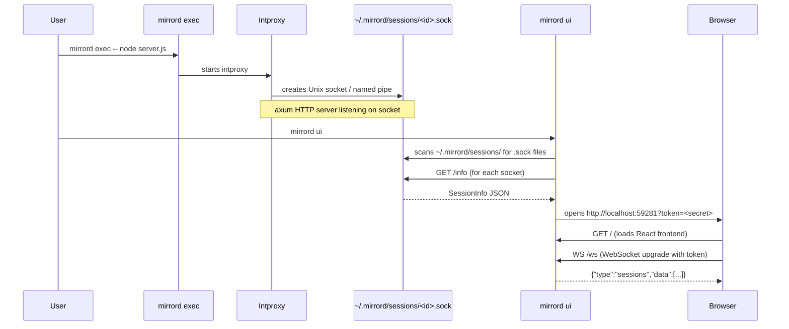
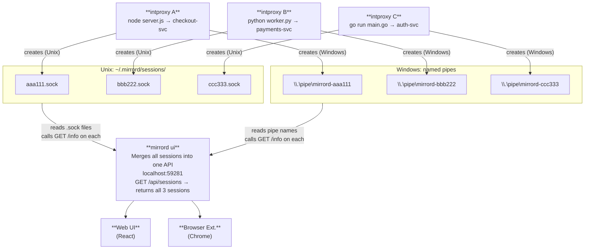
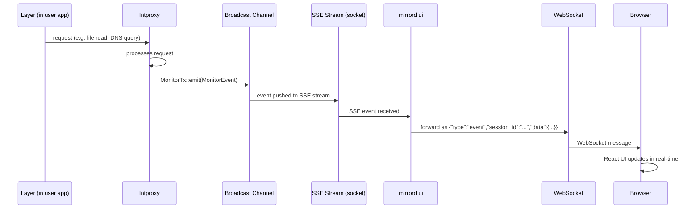
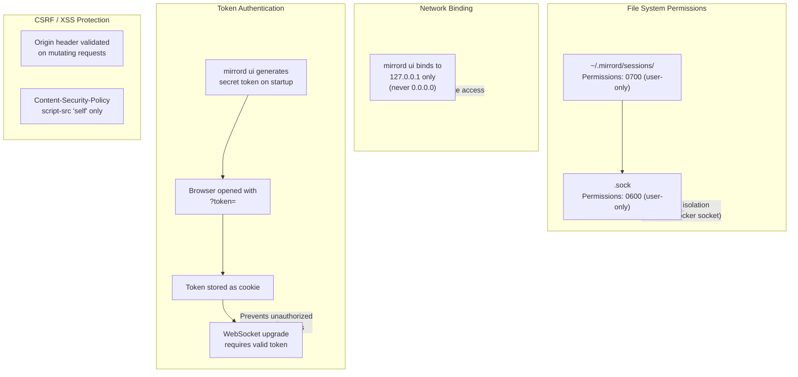

- Feature Name: api
- Start Date: 2026-03-13
- Last Updated: 2026-03-17
- RFC PR: [metalbear-co/rfcs#20](https://github.com/metalbear-co/rfcs/pull/20)
- RFC reference:
  - [Notion: mirrord Session Monitor Product Spec](https://www.notion.so/32215e39139481b289cacc87a9cdf257)
  - [metalbear-co/rfcs#8 (Dashboard Backend)](https://github.com/metalbear-co/rfcs/pull/8)
- Implementation:
  - Backend PR: [metalbear-co/mirrord#4039](https://github.com/metalbear-co/mirrord/pull/4039)
  - Frontend PR: [metalbear-co/mirrord#4040](https://github.com/metalbear-co/mirrord/pull/4040)
  - Linear: PRO-74 (parent), PRO-73 (Phase 1), PRO-65 (Phase 2)
  - Related: COR-392 (mirrord Control API)

## Summary
[summary]: #summary

Add a local session monitoring system to mirrord with two components: (1) each intproxy exposes a Unix socket or named pipe (using axum) at `~/.mirrord/sessions/` with an HTTP API that provides session info and streams real-time events via SSE, and (2) a `mirrord ui` command that discovers all active session sockets, aggregates them into a unified REST API and WebSocket, and serves a React web UI over localhost. The config flag is `api: { enabled: true }` (defaults to enabled). The system works for all users (OSS and Teams) with no operator dependency.

## Motivation
[motivation]: #motivation

mirrord is a "black box" to its users. When a developer runs `mirrord exec`, they see their application start, but have no visibility into what mirrord is doing behind the scenes. This creates problems:

1. **Debugging is blind** - When something doesn't work (wrong file served, missing env var, traffic not arriving), developers have no way to see what mirrord stole, what it forwarded remotely, and what fell back to local.

2. **No session awareness** - Developers don't know if their session is healthy, how much traffic is flowing, or which remote resources they're accessing.

3. **Configuration is guesswork** - Users set up mirrord configs (file filters, port subscriptions, outgoing filters) without feedback on whether the config is doing what they intended.

4. **No growth surface** - mirrord has no UI surface where we can show the value of Teams features to OSS users. The admin dashboard only reaches paying customers who have the operator.

5. **No programmatic access** - AI coding agents and scripts cannot query mirrord session state.

### Use Cases

1. **Developer debugging** - "My app isn't getting the right config. Let me open `mirrord ui` to see which files are being read remotely vs locally."

2. **Multi-session overview** - "I have 3 mirrord sessions running in different terminals. Let me see them all in one place."

3. **Traffic inspection** - "I'm stealing traffic on port 8080 but nothing's arriving. Let me check if the port subscription is active."

4. **Environment debugging** - "My app is connecting to the wrong database. Let me check which env vars mirrord fetched."

5. **Session management** - "I forgot to close a mirrord session in another terminal. Let me kill it from the UI."

6. **AI agent integration** - An AI coding agent queries the UI API to check session health after a test run.

## Guide-level explanation
[guide-level-explanation]: #guide-level-explanation

### Starting the UI

The Session Monitor is a separate command, not auto-launched:

```
$ mirrord ui
Session Monitor: http://localhost:59281
   Opening browser...
```

In IDEs, the command is available as "mirrord: Open UI" which opens the UI in a webview or starts `mirrord ui` if not running.

This starts a local web server that discovers and connects to all active mirrord sessions on the machine.



### Viewing Sessions

The UI shows all active sessions in one view, with each session displaying its target, runtime, ports, traffic stats, and quick actions (View Details). Kill Session is planned for v2.

Clicking "View Details" on a session expands it to show:
- Real-time event log (file ops, DNS, network, errors)
- Traffic stats breakdown (HTTP methods, status codes, latency)
- File operations detail (paths, read/write, remote vs local)
- DNS query log (hostname, resolved IPs, latency)
- Port subscriptions detail
- Environment variables fetched (keys only, values redacted by default)
- Outgoing connections (which external services the app talks to)
- mirrord config for this session

### Configuration

In `mirrord.json`:

```json
{
  "api": {
    "enabled": true
  }
}
```

- `api.enabled` (default: `true`): Controls whether the intproxy creates a Unix socket (or named pipe on Windows) for this session. The `api` field uses object format for future extensibility. When disabled, the intproxy will not create a socket file.

The `mirrord ui` command has its own flags:

```bash
mirrord ui                        # Start UI, auto-open browser
mirrord ui --no-open              # Start UI, don't open browser
mirrord ui --port 8080            # Use specific port
mirrord ui --sessions-dir /path   # Custom sessions directory
```

### Interaction with Existing Features

The session monitoring system is purely observational for v1. It does not modify mirrord's behavior. The kill endpoint (`POST /kill`) is planned for v2.

The intproxy lifecycle is extended slightly:
- On startup, the intproxy creates a Unix socket (or named pipe on Windows) at `~/.mirrord/sessions/<session-id>.sock`
- On shutdown, it removes the socket file
- Socket files are cleaned up automatically when no file descriptor references remain (standard Unix socket behavior). Additionally, `mirrord ui` detects stale sockets (connection refused) and removes them on startup

## Reference-level explanation
[reference-level-explanation]: #reference-level-explanation

### Architecture Overview

The system has two layers: session sockets (per-intproxy) and the aggregator/UI server (`mirrord ui`).



### Component 1: Session Socket (in intproxy)

Each intproxy instance creates a Unix domain socket (or named pipe on Windows) at `~/.mirrord/sessions/<session-id>.sock` on startup, serving an HTTP API via axum.

**Session ID**: For the local API socket, a UUID is generated in `execution.rs` at startup and used as the socket filename. This local ID is separate from the operator session ID — for copy target sessions, the operator/cluster controls the session ID, so we must not overwrite or reuse it. The local socket ID is passed to the intproxy via the `MIRRORD_SESSION_ID` environment variable and is used only for local IPC (socket filename + API responses).

**Socket directory**: `~/.mirrord/sessions/` is created with `0700` permissions (user-only access), following the Docker socket model. Socket files are created with `0600` permissions. This ensures only the current user can access their own sessions.

**Socket server architecture**: The socket server runs as a separate tokio task inside the intproxy (not in the main task). Events are distributed via a broadcast channel (bounded, capacity 256). Events are emitted via `MonitorTx::emit()` which is fire-and-forget. If the broadcast channel is full, new events replace old ones. If the socket server task crashes, the intproxy continues running normally.

**HTTP API on the Unix socket** (per-session, served by axum over `~/.mirrord/sessions/<id>.sock`, not exposed over TCP):

```
GET  /health          → Health check (returns 200 OK)
GET  /info            → Session info (returns SessionInfo JSON)
GET  /events          → SSE stream of MonitorEvents
POST /kill            → Kill session (planned for v2, not implemented in v1)
```

**SessionInfo** (returned by GET /info):

```rust
pub struct ProcessInfo {
    pid: u32,
    process_name: String,
}

pub struct SessionInfo {
    session_id: String,
    target: String,
    started_at: String,         // ISO 8601
    mirrord_version: String,
    is_operator: bool,
    processes: Vec<ProcessInfo>, // sessions can have multiple processes/PIDs
    config: serde_json::Value,   // full mirrord config for this session (replaces mode field)
    filter: Option<String>,      // traffic filter expression, if configured
}
```

> **Note**: The `session_id` for copy target sessions is controlled by the cluster (operator), not generated locally.

> **Note**: The `mode` field is intentionally omitted. The session's steal/mirror mode and other settings are available in the `config` field, which contains the full mirrord configuration used for this session.



> **Note**: v1 `MonitorEvent`s represent what the client/layer *requested* (outbound from the client's perspective), not agent responses. For example, a `FileOp` event means the layer asked to read a file remotely, not that the agent returned data. Agent-side response events (latency, errors, payloads) are planned for v2.

**MonitorEvent** (streamed via SSE on GET /events):

```rust
#[derive(Serialize)]
#[serde(tag = "type")]
pub enum MonitorEvent {
    FileOp {
        path: String,
        operation: String,  // "read", "write", "stat", "unlink", "mkdir", etc.
    },
    DnsQuery {
        host: String,
    },
    OutgoingConnection {
        address: String,
        port: u16,
    },
    PortSubscription {
        port: u16,
        mode: String,       // "steal", "mirror"
    },
    EnvVar {
        vars: Vec<(String, String)>,  // key-value pairs of fetched env vars
    },
    LayerConnected {
        pid: u32,
    },
    LayerDisconnected,
}
```

The `filter` field on `SessionInfo` reflects the traffic filter expression from the mirrord config (e.g., header filters for steal). This is surfaced at the session level so the UI can display which traffic subset is being stolen.

**Event emission**: Events are emitted at various points in the intproxy by calling `MonitorTx::emit()`. This method is fire-and-forget: it sends the event into the broadcast channel without waiting for any consumer. If no client is connected to the SSE stream, events are simply dropped.

**Cleanup**: On intproxy exit (normal or crash), the socket file should be removed. The intproxy registers a shutdown hook to delete the file. Unix socket files are also cleaned up by the OS when no file descriptor references them. For additional safety, `mirrord ui` detects stale sockets (connection refused) and removes them on startup.

### Component 2: Aggregator (`mirrord ui`)

A new subcommand that runs a web server aggregating all local sessions.

**Startup sequence:**

1. Scan `~/.mirrord/sessions/` for `*.sock` files
2. For each, attempt to connect and call GET /info
3. Clean up stale entries (socket exists but connection refused — sock files with no fd references are already cleaned by the OS)
4. Start HTTP server on `127.0.0.1:<port>`
5. Print URL: `http://localhost:59281`
6. Open browser (unless `--no-open`)
7. Watch `~/.mirrord/sessions/` directory for new/removed sockets or named pipes (via `notify` crate or polling)
8. For each connected session socket, maintain a tokio task that reads the SSE stream and forwards events to WebSocket clients

**Security model:**



- **Unix socket permissions**: `~/.mirrord/sessions/` has `0700`, socket files have `0600`. Only the user can access their sessions. Same model as Docker's `/var/run/docker.sock`.
- **Localhost binding**: `127.0.0.1` only, never `0.0.0.0`.
- **WebSocket authentication**: On startup, `mirrord ui` generates a secret token and includes it as a query parameter in the URL opened in the browser (e.g., `http://localhost:59281?token=<secret>`). The frontend stores this token as a cookie. All WebSocket upgrade requests must include this token (via cookie or query param). This prevents other local applications from connecting to the WebSocket without the token.
- **CSRF protection**: The API validates the `Origin` header on all mutating requests (POST /kill, etc.) to ensure they originate from the expected localhost origin.
- **XSS protections**: The embedded React frontend is served with `Content-Security-Policy` headers restricting script sources to `'self'` only. No inline scripts are allowed.

**HTTP endpoints (browser-facing, served by `mirrord ui` on localhost:59281):**

```
GET  /                      → Serve React frontend (index.html)
GET  /assets/*              → Static JS/CSS assets
GET  /api/sessions          → List all active sessions (JSON)
GET  /api/sessions/:id      → Session detail + current state (JSON)
POST /api/sessions/:id/kill → Kill session (planned for v2, forwards to socket's POST /kill)
GET  /api/version           → mirrord version, OSS/Teams status
WS   /ws                    → WebSocket: aggregated events from all sessions
WS   /ws/:id                → WebSocket: events from a specific session
```

**WebSocket protocol (browser-facing):**

```
Client connects to /ws
  → Server sends: {"type":"sessions","data":[...list of all sessions with state...]}
  → Server streams: {"type":"event","session_id":"a8f3b2c1","data":{...MonitorEvent...}}
  → Server streams: {"type":"session_added","data":{...session metadata...}}
  → Server streams: {"type":"session_removed","session_id":"a8f3b2c1"}
  ...
```

**Static asset embedding**: The React frontend is embedded in the mirrord CLI binary using `rust-embed`. The `mirrord ui` command serves these assets. If running a development build without embedded assets, it can optionally proxy to a Vite dev server (configurable via `--dev` flag).

### Multi-Session Data Flow

```
Session 1 intproxy ──Unix Socket/Named Pipe──┐
                                             │
Session 2 intproxy ──Unix Socket/Named Pipe──┼──► mirrord ui ──HTTP+WS──► Browser
                                             │
Session 3 intproxy ──Unix Socket/Named Pipe──┘
```

The `mirrord ui` process maintains a `HashMap<SessionId, SessionConnection>` where each `SessionConnection` is a tokio task reading from the Unix socket's (or named pipe's) SSE stream and forwarding events to the WebSocket broadcast channel.

When a new socket appears in `~/.mirrord/sessions/`, `mirrord ui` connects to it automatically. When a socket disappears (session ended), the corresponding task is cleaned up and a `session_removed` event is sent to WebSocket clients.

### Performance Impact

**On the intproxy (per session):**
- CPU: Serializing MonitorEvents to JSON adds ~1% overhead (serde_json per event)
- Memory: Broadcast channel bounded at capacity 256
- I/O: Unix socket writes are negligible (local IPC)
- When no client is connected: events are dropped (broadcast channel with no receivers)

**On `mirrord ui`:**
- Aggregates events from all sessions. Memory scales linearly with number of active sessions.
- WebSocket broadcasts to browser clients add minimal overhead.

**When disabled (`api: { enabled: false }`):**
- Zero overhead. No socket file created, no event tracking in intproxy.

### Version and License Display

The UI header shows:
- mirrord version (compiled into the binary)
- OSS vs Teams status (detected by checking if operator is configured/reachable)
- If Teams: subscription tier and license info (fetched from operator)
- If OSS: "Upgrade to Teams" CTA

## Drawbacks
[drawbacks]: #drawbacks

1. **Two-process model**: `mirrord ui` is a separate process from the intproxy. Users must explicitly run it. This is intentional (following Aviram's architecture), but some users may expect auto-launch.

2. **Platform-specific IPC**: Unix sockets are used on macOS/Linux; named pipes on Windows. Both are supported but the implementation requires platform-specific code paths.

3. **Binary size increase**: Embedding the React frontend adds ~200-300KB. Small relative to the ~30MB mirrord binary.

4. **Build complexity**: CI needs Node.js to build the frontend before embedding in the Rust binary.

5. **Stale socket cleanup**: If an intproxy crashes without cleaning up its socket, stale files may remain. Unix sockets are cleaned up when no fd references them. Additionally, `mirrord ui` detects stale sockets (connection refused) and removes them.

6. **Security surface**: Even with Unix permissions and localhost binding, a local attacker with the same UID could connect to the Unix sockets. This is mitigated by the secret token authentication on the WebSocket. This follows the same threat model as Docker.

## Rationale and alternatives
[rationale-and-alternatives]: #rationale-and-alternatives

### Why Unix sockets + separate UI server (vs embedded HTTP per intproxy)?

An earlier draft of this RFC proposed embedding an HTTP server directly in each intproxy. The Unix socket + `mirrord ui` architecture is better because:

- **Multi-session aggregation**: One UI shows all sessions. No need to remember different ports for different sessions.
- **Security**: Unix socket permissions (0700) provide OS-level access control. The `mirrord ui` server binds to localhost only.
- **Separation of concerns**: The intproxy stays focused on proxying. The UI server is a separate concern.
- **Resource efficiency**: Only one HTTP server running (the `mirrord ui` process), not one per session.

### Why not the layer?

The layer runs inside the user's process via LD_PRELOAD. Adding any IPC there would:
- Compete with the application's own I/O and runtime (e.g., its async runtime or main loop, if it has one)
- Risk interfering with the application's own socket usage
- Not support multi-layer aggregation

### Why not a TUI?

A terminal UI (like k9s) is hostile to AI coding agents, which work best with structured CLI output. The browser UI is for humans, the API is for agents. A TUI falls between these and serves neither well.

### Why localhost-only HTTP (no TLS)?

The security model relies on Unix socket permissions (0700/0600) for the per-session sockets, localhost-only binding for the `mirrord ui` server, and secret token authentication for WebSocket connections. TLS was considered but not implemented for v1 because: (a) self-signed certificates cause browser warnings that are poor UX, (b) localhost binding already prevents remote access, and (c) the session data is not highly sensitive (file paths, DNS queries, connection metadata). This follows a similar model to many local dev tools.

### Impact of not doing this

mirrord remains a black box. No growth surface for OSS-to-Teams conversion. AI agents can't interact with mirrord sessions programmatically.

## Unresolved questions
[unresolved-questions]: #unresolved-questions

1. **Event granularity**: Should every individual `read()` syscall generate a MonitorEvent, or should we batch/aggregate? High-throughput applications could generate thousands of file reads per second. Proposal: aggregate counters in the intproxy, emit individual events only for "interesting" operations (first access to a new file path, errors, DNS queries, new connections).

2. **Env var value redaction**: Env var key-value pairs are now included in events. Should values be shown in the UI by default? Proposal: redact values by default in the UI, with opt-in via `mirrord ui --show-env-values` for debugging. The API always returns full key-value pairs.

3. **Frontend location in repo**: Options: (a) `mirrord/monitor-ui/` in the main mirrord repo (recommended, since it ships with the CLI binary), (b) separate `mirrord-monitor` repo.

4. **Socket protocol versioning**: How to handle protocol changes between mirrord versions? If a user runs `mirrord ui` v3.166 but has an active session from `mirrord exec` v3.165, the socket protocol must be compatible. Proposal: include a `protocol_version` field in the session info and handle gracefully.

5. **Windows support**: Named pipes are used on Windows (as shown in the architecture diagram). The implementation requires platform-specific abstractions for the IPC layer.

6. **Session directory on shared machines**: If multiple users share a machine, `~/.mirrord/sessions/` is per-user (different home dirs). Is there a use case for a system-wide sessions directory?

## Future possibilities
[future-possibilities]: #future-possibilities

1. **Teams features in UI**: When the operator is available, the UI can show remote sessions (who else is targeting this service), session history, and target topology. Locked for OSS users as upsell surface.

2. **Session control actions** (Teams): Via the operator API, the UI could offer actions like restart agent, drop sockets, and pause stealing. These would be additional commands sent over the Unix socket and forwarded to the operator.

3. **IDE integration**: VS Code command "mirrord: Open UI" that triggers the UI loading directly from the IDE — either opening the `mirrord ui` URL in a webview or starting `mirrord ui` if not already running. IntelliJ equivalent.

4. **Config suggestions**: Based on observed patterns (files read remotely that could be local, ports not receiving traffic), suggest mirrord config improvements directly in the UI.

5. **Session recording**: `mirrord exec --record session.json` saves the event stream to a file. `mirrord ui --replay session.json` replays it in the UI for post-mortem debugging.

6. **MCP server**: Expose the session data as an MCP (Model Context Protocol) server that AI coding agents can connect to directly, rather than parsing CLI output.

7. **`mirrord up` integration**: When `mirrord up` (docker-compose style multi-service mirroring) is implemented, the session monitor can provide a unified view of all services being mirrored, with per-service drill-down.
