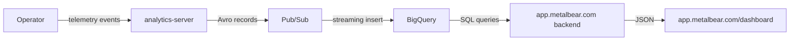

- Feature Name: cloud_dashboard
- Start Date: 2026-03-30
- RFC PR: TBD
- RFC reference:
  - [Linear PRO-85](https://linear.app/metalbear/issue/PRO-85/migrate-dashboard-backend-from-license-server-to-appmetalbearco)
  - Extends [RFC 0002: Dashboard Backend](./0002-dashboard-backend.md)

## Summary

Make the mirrord utilization dashboard available on app.metalbear.com for Teams and self-serve customers. The dashboard queries existing telemetry data in BigQuery (already collected by analytics-server) and displays it through the same React UI used for the in-cluster Enterprise dashboard.

## Motivation

Currently the utilization dashboard only works for Enterprise customers who deploy it in-cluster. Teams and self-serve customers have no visibility into their mirrord usage. The data already exists in BigQuery via the analytics-server pipeline, we just need to surface it.

### Goals

1. Teams/self-serve users can view usage dashboard on app.metalbear.com
2. Dashboard shows the same metrics as the in-cluster version (sessions, users, trends)
3. Data is anonymized by default (hashed user identifiers)
4. Enterprise customers can optionally opt-in to share cleartext identifiers for a richer view on app.metalbear.com

### Non-goals

- Replacing the in-cluster Enterprise dashboard (it continues to work as-is)
- Real-time streaming (BigQuery has inherent latency, near-real-time is fine)

## How it works

### Data flow

The operator already reports session events to analytics-server, which writes `SessionEventAvro` records to BigQuery via Pub/Sub. Each record contains:

- `user_id` (hashed by default)
- `duration` (session duration in seconds)
- `ci` (boolean, whether session was CI)
- `license_hash`
- `organization_id`
- `timestamp`

### What we add

**1. New API endpoints on app.metalbear.com backend:**

- `GET /api/v1/dashboard/usage?from=<iso>&to=<iso>` - Returns general metrics, all-time metrics, per-user breakdown
- `GET /api/v1/dashboard/trends?days=30` - Returns daily session counts, adoption curve

Both endpoints are authenticated via Frontegg (same as all other app.metalbear.com endpoints). Data is scoped to the user's organization via `organization_id` in BigQuery.

**2. Dashboard UI on app.metalbear.com frontend:**

New route at `/dashboard` in the React app. Reuses the existing dashboard components from `operator/dashboard/`, rewired to call the new API endpoints instead of the license server.

**3. Anonymization toggle (Phase 2):**

A Helm chart value `telemetry.shareUserIdentity: true` tells the operator to send cleartext user names instead of hashed identifiers. Default is `false` (hashed). When enabled, the dashboard on app.metalbear.com shows real user names.

### BigQuery data availability

The `SessionEventAvro` schema already has everything needed for the core dashboard:

| Dashboard metric | BigQuery source |
|-----------------|-----------------|
| Active users | `COUNT(DISTINCT user_id) WHERE timestamp > from` |
| Total sessions | `COUNT(*)` |
| Avg session duration | `AVG(duration)` |
| Per-user metrics | `GROUP BY user_id` |
| Daily trends | `GROUP BY DATE(timestamp)` |
| CI sessions | `WHERE ci = true` |

**Missing data (gaps to fill later):**

- Target information (which deployment was mirrored) - not in current telemetry events
- Operator version - available in metadata but not per-session

These can be added incrementally by extending the `SessionEventAvro` schema.

## Implementation phases

### Phase 1: Backend API + basic frontend

1. Add BigQuery queries to app.metalbear.com backend for usage and trends
2. Add `/api/v1/dashboard/usage` and `/api/v1/dashboard/trends` endpoints
3. Copy dashboard React components, wire to new endpoints
4. Gate behind PostHog feature flag for gradual rollout

### Phase 2: Anonymization toggle

1. Add `telemetry.shareUserIdentity` Helm chart value
2. Modify operator to conditionally hash user identifiers
3. Dashboard shows cleartext names when available

### Phase 3: Enriched data

1. Add target info to session telemetry events
2. Add operator version per-session
3. Surface in dashboard

### Frontend component strategy

The dashboard React components are copied from `operator/dashboard/` into `app.metalbear.co` for Phase 1. The two dashboards will diverge in their API layer (in-cluster talks to license server, cloud talks to app.metalbear.com with Frontegg auth), so a shared package is premature. If the visual components stay aligned over time and duplication becomes painful, extract shared components to `@metalbear/ui` as a future optimization.
